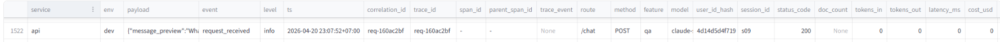

# Day 13 Observability Lab Report

> **Instruction**: Fill in all sections below. This report is designed to be parsed by an automated grading assistant. Ensure all tags (e.g., `[GROUP_NAME]`) are preserved.

## 1. Team Metadata
- [GROUP_NAME]: C401 - B4
- [REPO_URL] : `https://github.com/phuongub/Lab13-Observability.git`
- [MEMBERS]:
  - Member A: Phạm Nguyễn Tiến Mạnh | Role: Logging & PII
  - Member B: Trịnh Uyên Chi | Role: Tracing & Enrichment
  - Member C: Nguyễn Hoàng Nghĩa | Role: SLO & Alerts
  - Member D: Trần Việt Phương | Role: Load Test & Incident Injection
  - Member E: Nguyễn Thị Thùy Trang | Role: Dashboard & Demo & Report

---

## 2. Group Performance (Auto-Verified)
- [VALIDATE_LOGS_FINAL_SCORE]&#58; 100/100
- [TOTAL_TRACES_COUNT]&#58; 188 
- [PII_LEAKS_FOUND]&#58; 0

---

## 3. Technical Evidence (Group)

### 3.1 Logging & Tracing
- [EVIDENCE_CORRELATION_ID_SCREENSHOT]&#58; 
- [EVIDENCE_PII_REDACTION_SCREENSHOT]&#58; 
- [EVIDENCE_TRACE_WATERFALL_SCREENSHOT]&#58; 
- [TRACE_WATERFALL_EXPLANATION]&#58; Span "llm_generate" chiếm phần lớn thời gian (~0.15s trên tổng ~0.16s), 
trong khi "retrieve_context" gần như tức thời (~0.00s). 
Điều này cho thấy bước sinh câu trả lời (LLM) là bottleneck chính của hệ thống, 
phù hợp với đặc điểm của pipeline RAG.

### 3.2 Dashboard & SLOs
- [DASHBOARD_6_PANELS_SCREENSHOT]&#58; 
- [SLO_TABLE]&#58;

| SLI | Target | Window | Current Value |
|---|---:|---|---:|
| Latency P95 | < 3000ms | 28d | 860.2 ms |
| Error Rate | < 2% | 28d | 0.62% |
| Cost Budget | < $2.5/day | 1d | $0.2529 |

### 3.3 Alerts & Runbook
- [ALERT_RULES_SCREENSHOT]&#58; 
---

## 4. Incident Response (Group)
- [SCENARIO_NAME]&#58; quality_proxy_degradation

- [SYMPTOMS_OBSERVED]&#58; Dashboard ghi nhận:
  - `Bad Quality Rate = 86.60%`, vượt ngưỡng alert `20%`
  - `Avg Quality = 0.11`, rất thấp
  - Trong khi `Latency P95 = 860.2 ms` và `Error Rate = 0.62%` vẫn trong ngưỡng cho phép

  => Điều này cho thấy hệ thống vẫn phản hồi được request, nhưng chỉ số chất lượng đầu ra đang giảm mạnh.

- [ROOT_CAUSE_PROVED_BY]&#58;  
  - Dựa trên trace log và raw logs, nhiều request có `response_sent` với `answer_preview` mang tính generic, ngắn hoặc không chứa từ khóa liên quan tới câu hỏi thời trang.  
  - Ngoài ra, trong code hiện tại, `quality_score` được tính theo heuristic/proxy metric (độ dài câu trả lời, mức độ liên quan từ khóa, có context hay không), không phải đánh giá bởi người dùng thật hay LLM judge.  
  - Vì nhóm sử dụng mock LLM, mock data và mock RAG, nên bad quality rate cao chủ yếu phản ánh việc rule heuristic đánh giá nhiều response mock là "kém chất lượng".

- [FIX_ACTION]&#58;  
  - Rà soát lại logic tính `quality_score` để phù hợp hơn với use case chatbot tư vấn thời trang
  - Điều chỉnh response template của mock LLM để bớt generic và sát intent hơn
  - Cải thiện mock retrieval/context để response có thêm thông tin liên quan tới size, style, shipping hoặc policy

- [PREVENTIVE_MEASURE]&#58;  
  - Giữ alert cho `bad_quality_rate` để phát hiện sớm khi quality proxy tăng bất thường
  - Tách rõ giữa “proxy quality metric” và “true user quality” trong tài liệu/report
  - Bổ sung thêm test cases cho từng feature (`qa`, `policy`, `shipping`, `style`, `material`) để kiểm tra độ phù hợp của response mock trước khi demo

---

## 5. Individual Contributions & Evidence

### Phạm Nguyễn Tiến Mạnh
- [TASKS_COMPLETED]: 
  - Hoàn thiện cấu hình logging trong logging_config.py để chuẩn hóa log JSONL, tự bổ sung các field bắt buộc như service, correlation_id, route, method, user_id_hash, session_id, feature, model.
  - Triển khai PII scrubbing trong pii.py và logging_config.py để che email, số điện thoại, CCCD, credit card, bearer token, API key và password trước khi ghi vào logs.jsonl
- [EVIDENCE_LINK]: 
  - Commit hash:
`128c34a3cab9ec90e903ed6c4696b49c2a67d150`
`c96a1cc3bbfac0abde44d17d4fdabfb701dc6336`
  - Commit link:
`https://github.com/phuongub/Lab13-Observability/commit/128c34a3cab9ec90e903ed6c4696b49c2a67d150`
`https://github.com/phuongub/Lab13-Observability/commit/c96a1cc3bbfac0abde44d17d4fdabfb701dc6336`

### Trịnh Uyên Chi
- [TASKS_COMPLETED]: 
  - Hoàn thiện CorrelationIdMiddleware trong middleware.py để tự động khởi tạo, gắn thẻ correlation_id, dọn dẹp context và đo lường thời gian xử lý (latency) cho từng request.
  - Cấu hình bind_contextvars trong main.py để theo dấu ngữ cảnh (user_id_hash bảo mật, session_id, feature, model, env)
  - Viết lại mock_rag.py và mock_llm.py theo chủ đề Chatbot hỗ trợ tư vấn quần áo cho shop thời trang.
  - Xây dựng tệp dữ liệu test (test_queries.jsonl) bao phủ toàn bộ các tình huống người dùng thực tế để phục vụ cho việc Load Test và kiểm tra luồng Tracing.
  - Chạy kịch bản load_test.py và xác nhận dữ liệu log/tracing xuất ra đầy đủ, mượt mà và không bị nghẽn (HTTP 200).
- [EVIDENCE_LINK]: 
  - Commit hash:
`4e07b36405cf2a00f28196d84ad6b227cd8385c9`
`cad5c2f8baf8c1b1115cb5f6c86e2f0aac9f4b16`
  - Commit link:
`https://github.com/VinUni-AI20k/Lab13-Observability/commit/4e07b36405cf2a00f28196d84ad6b227cd8385c9`
`https://github.com/VinUni-AI20k/Lab13-Observability/commit/cad5c2f8baf8c1b1115cb5f6c86e2f0aac9f4b16`

### Nguyễn Hoàng Nghĩa
- [TASKS_COMPLETED]: 
  - Xác định các Service Level Objectives (SLOs) cho các chỉ số hệ thống quan trọng
  - Thiết kế và triển khai các quy tắc cảnh báo trong file config/alert_rules.yaml
  - Căn chỉnh ngưỡng cảnh báo phù hợp với mục tiêu SLO (cảnh báo sớm trước khi vi phạm SLO) và xây dựng tài liệu hướng dẫn xử lý cảnh báo trong docs/alerts.md
- [EVIDENCE_LINK] 
  - Commit hash: `43f4f50fd7adc3e54794efe008de05b1769a79ee`
  - Commit link:
`https://github.com/VinUni-AI20k/Lab13-Observability/commit/43f4f50fd7adc3e54794efe008de05b1769a79ee`

### Trần Việt Phương 
- [TASKS_COMPLETED]: Incident injection, load test.Bổ sung 3 incidents tương ứng với các Alert cơ bản.  File đã sửa: scripts/inject_incident.py; app/incidents.py, data/incidents.json. 
- [EVIDENCE_LINK]: 
  - Commit hash: `2c8d01b8f1f7a35da2095a212ea2da87a1f80eda`
  - Commit link: `https://github.com/phuongub/Lab13-Observability/tree/2c8d01b8f1f7a35da2095a212ea2da87a1f80eda87a1f80eda`

### Nguyễn Thị Thùy Trang
- [TASKS_COMPLETED]: 
  - Xây dựng dashboard (6 panels)  
  - Tích hợp & debug Langfuse tracing  
  - Hiển thị trace logs trên dashboard  
  - Thu thập evidence & viết report, chuẩn bị demo
  - File đã sửa: `blueprint-template.md`, `grading-evidence.md`, `tracing.py`, `dashboard.py`, `load_test.py`  
- [EVIDENCE_LINK]: 
  - Commit hash: `0e59b7317511ffd2052f02a0235dd6deea65b295`
  - Commit link: `https://github.com/phuongub/Lab13-Observability/commit/0e59b7317511ffd2052f02a0235dd6deea65b295`

---

## 6. Bonus Items (Optional)
<!-- - [BONUS_COST_OPTIMIZATION]: (Description + Evidence)
- [BONUS_AUDIT_LOGS]: (Description + Evidence)
- [BONUS_CUSTOM_METRIC]: (Description + Evidence) -->
