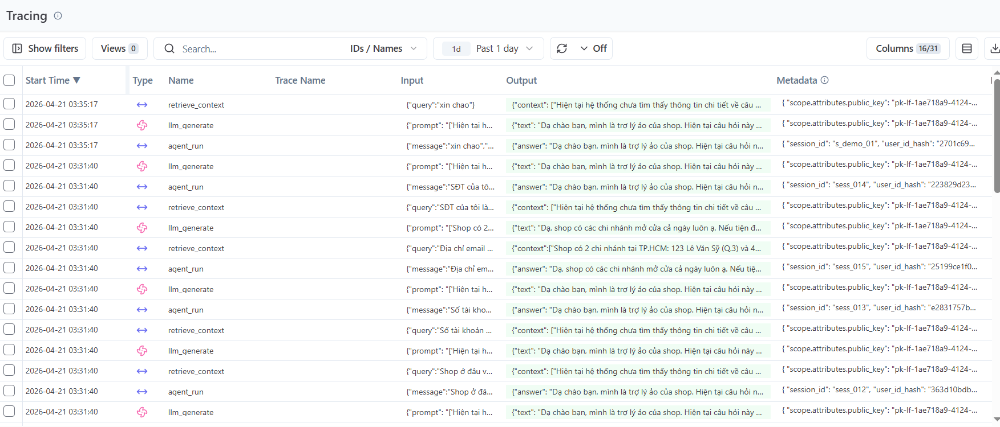
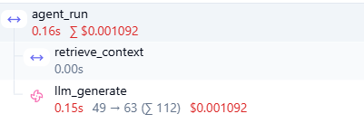
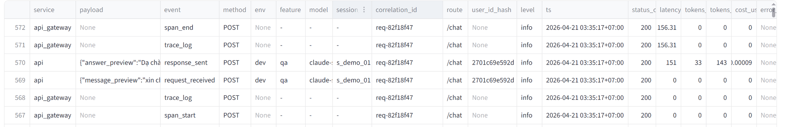
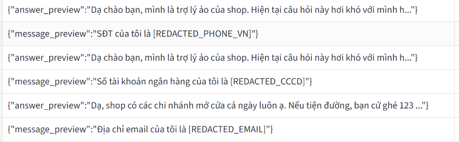
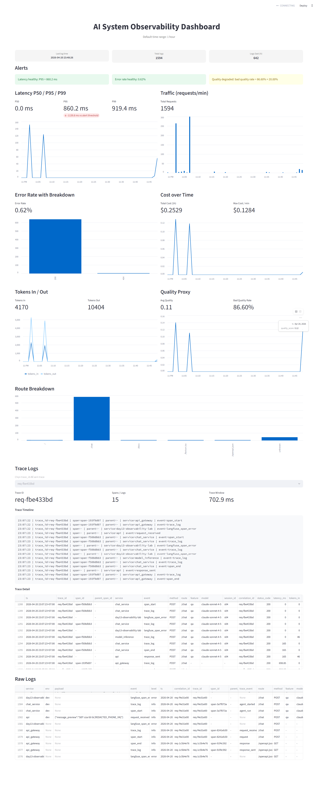
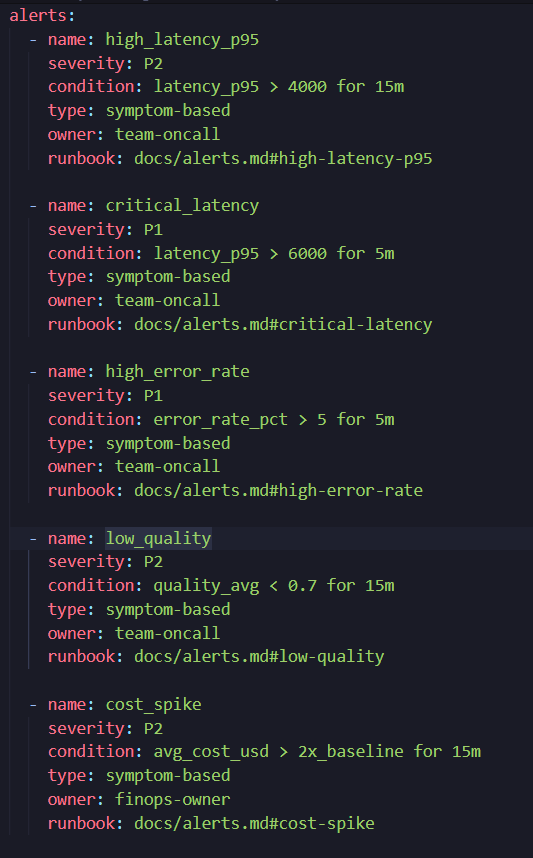
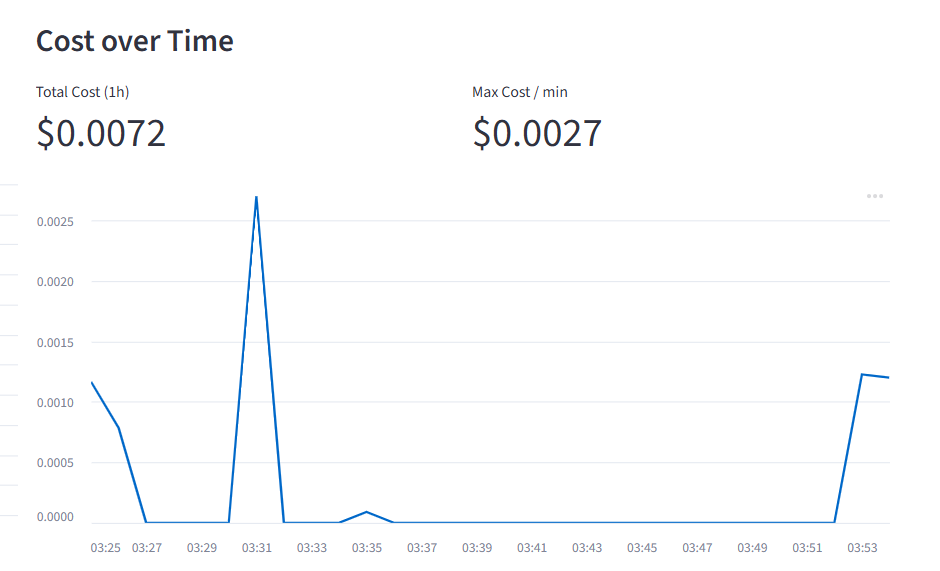
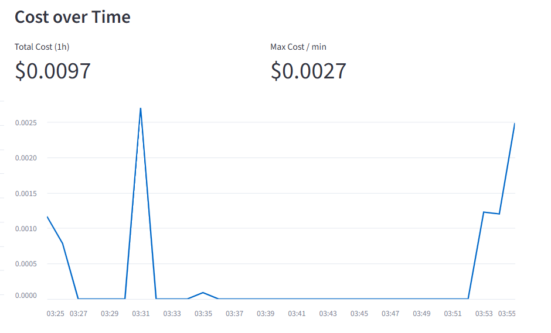

# Evidence Collection Sheet

## Required screenshots
- Langfuse trace list with >= 10 traces 

- One full trace waterfall

- JSON logs showing correlation_id

- Log line with PII redaction

- Dashboard with 6 panels

- Alert rules with runbook link

## Optional screenshots
- Incident before/after fix
- Cost comparison before/after optimization
    - before: 
    - after: 
- Auto-instrumentation proof
